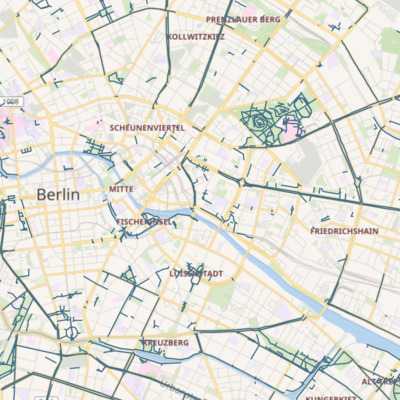

[](https://greenkeeper.io/)

# Family-friendly bike paths

This project maps family-friendly bike paths, to illustrate a single point:

**In Berlin, you can get anywhere by car. But not by bike. 🚳**

[](https://www.familienradwege.de)

## Where does the map data come from?

This project only builds the website _without map data_.
The map data is compiled [elsewhere](https://github.com/awendt/familienradwege).

For convenience, this project provides tools to download everything locally.

## Getting started

### Prerequisites

This is the software you need to develop the website:

1. GNU Make
2. NodeJS v10 or newer + NPM
3. Pandoc v2.7 or newer

<details>
<summary>How do I know I have everything installed?</summary>

Run the following, every line should have a check mark:

```bash
$ make check
✔ node
✔ npm
✔ pandoc
```
</details>

### Building the project

Once you have all required software, in the root directory of this project, run:

```
$ make
```

This will do the following:

1. Install project dependencies (into `node_modules`)
2. Download map data
3. Create all HTML and all referenced files (images, CSS) and place them into the sub-directory `website/`

To view the website, run:

```
$ make server
```

and point your browser to http://localhost:1234/.
You can adjust the port using `make server PORT=4321`.

### Re-build when files change

If you leave `make server` running in a terminal and run watch mode in another,
you can change files and see the changes immediately in your browser:

```
$ make watch
```

### Creating new pages

You can find all content under [`pages`](pages).
Each Markdown file in there represents one page
(except for `footer.md` which is appended to each generated HTML file).


To create a new page:

1. Create a new `.md` file in `pages`
2. Add it to the `HTML =` line at the top of [`Makefile`](Makefile).
