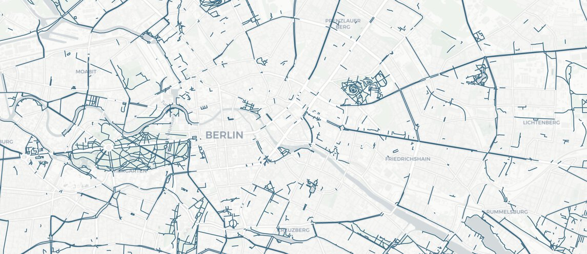
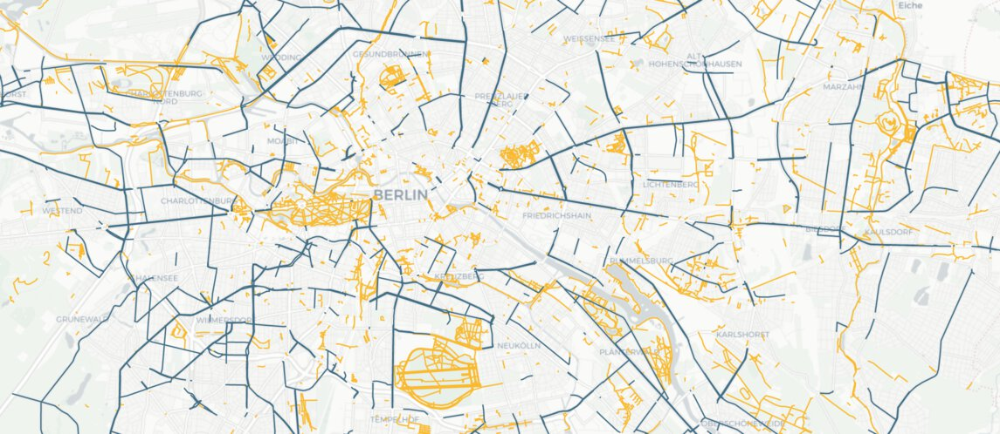
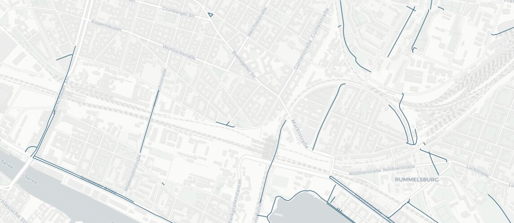

# Familienradwege in Berlin

## &#x1F6B3; Innenstadt: keine Durchfahrt

Der Innenstadtring umschließt die historische Mitte Berlins in den Bezirken Mitte,
Pankow und Friedrichshain-Kreuzberg. Seine Ost-West-Ausdehnung beträgt etwa 5
Kilometer – eine Entfernung ideal fürs Fahrrad. Auf dem Rad können Familien ihn aber
weder durchqueren noch komplett um die Innenstadt fahren.

  

## &#x1F333; Parks: Radfahren als Hobby

Die höchste Dichte an Radwegen findet man in Parks.
Das Fahrrad wird also eher als Spielzeug und Freizeitbeschäftigung,
nicht aber zur Fortbewegung gesehen.

  

## &#x1F3DA; Ein Flickenteppich

Für alltägliche Wege (zur Schule, zum Einkaufen, zur Arztpraxis, zur Bibliothek) gibt
es keine zusammenhängende Infrastruktur, nur mal ein paar hundert Meter hier und ein
paar dort.

Das Viertel um den Boxhagener Platz (~1&#8239;km²) beispielsweise hat ein Straßennetz 
von über 16 Kilometern Länge. Hier gibt es 400 Meter familiengerechte Radwege!
Und so sieht es überall in der Stadt aus.

  

## &#x1F50E; Und was findest *du* auf der Karte?

&#x2B06; Gehe [zurück zur Karte](#mapid).

[zur Startseite](/){.btn}
